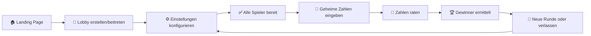

# 🎯 Bulls & Cows Multiplayer

<div align="center">
  <h3>Ein interaktives Multiplayer Bulls and Cows Spiel für den Browser</h3>
  <p>Real-time Multiplayer • Lobby-System • Konfigurierbare Einstellungen</p>
  
  [](https://nextjs.org/)
  [](https://www.typescriptlang.org/)
  [](https://socket.io/)
  [](https://tailwindcss.com/)
  [](https://jestjs.io/)
  [](https://opensource.org/licenses/MIT)
</div>

---

## 🚀 Quick Start

```bash
# Repository klonen
git clone https://github.com/Shaco74/cows-and-bulls.git
cd cows-and-bulls

# Dependencies installieren
npm install

# Development Server starten
npm run dev

# 🌐 Im Browser öffnen: http://localhost:3000
```

## 🎮 Spielregeln

<table>
<tr>
<td width="33%">

### 🔢 Setup
Jeder Spieler wählt eine **geheime Zahl** mit eindeutigen Ziffern (3-6 Stellen)

</td>
<td width="33%">

### 🎯 Raten
Alle Spieler raten **gleichzeitig** die ihnen zugewiesene Zahl

</td>
<td width="33%">

### 🏆 Gewinnen
**Erster** mit der korrekten Zahl gewinnt die Runde

</td>
</tr>
</table>

### Bulls & Cows Erklärt

- **🐂 Bulls**: Richtige Ziffer an **richtiger** Stelle
- **🐄 Cows**: Richtige Ziffer an **falscher** Stelle

**Beispiel:** Geheime Zahl `1234`, dein Tipp `1324`
- `1` an Position 1 = 1 Bull 🐂
- `3` und `2` sind vertauscht = 2 Cows 🐄
- `4` an Position 4 = 1 Bull 🐂
- **Ergebnis: 2 Bulls, 2 Cows**

---

## ✨ Features

<div align="center">

| Feature | Status | Beschreibung |
|---------|---------|-------------|
| 🏠 **Lobby-System** | ✅ | 6-stellige Codes zum Beitreten |
| ⚡ **Real-time Multiplayer** | ✅ | Live Updates mit Socket.IO |
| ⚙️ **Konfigurierbare Settings** | ✅ | 3-6 Ziffern wählbar |
| 🎯 **Bulls & Cows Engine** | ✅ | Vollständig getestete Spiel-Logik |
| 📱 **Responsive Design** | ✅ | Mobile & Desktop optimiert |
| 🏆 **Win Detection** | ✅ | Automatische Gewinnererkennung |
| 🔄 **Neue Runden** | ✅ | Nahtlos neue Spiele starten |
| 🧪 **100% Getestet** | ✅ | Umfangreiche Jest Test Suite |

</div>

---

## 🎯 Spielablauf



### Detaillierter Ablauf

1. **🏠 Landing Page**
   - Lobby erstellen oder beitreten
   - Spielername eingeben

2. **🎪 Lobby**
   - Warten auf weitere Spieler
   - Host konfiguriert Zahlenlänge (3-6 Stellen)
   - Alle setzen sich auf "Bereit"

3. **🔢 Setup Phase**
   - Jeder gibt eine geheime Zahl ein
   - System weist Zahlen zirkulär zu
   - Spieler A rät Zahl von Spieler B, etc.

4. **🎯 Spiel Phase**
   - Gleichzeitiges Raten
   - Live Feedback: Bulls & Cows
   - Verlauf aller Versuche sichtbar

5. **🏆 Ende**
   - Gewinner-Anzeige
   - Statistiken der Runde
   - Option für neue Runde

---

## 🛠 Tech Stack

<div align="center">

### Frontend
[](https://nextjs.org/)
[](https://reactjs.org/)
[](https://www.typescriptlang.org/)
[](https://tailwindcss.com/)

### Backend & Real-time
[](https://socket.io/)
[](https://nodejs.org/)

### Development & Testing
[](https://jestjs.io/)
[](https://testing-library.com/)
[](https://eslint.org/)

</div>

---

## 📁 Projektstruktur

```
cows-and-bulls/
├── 📱 app/                          # Next.js App Router
│   ├── page.tsx                     # 🏠 Landing Page
│   ├── layout.tsx                   # 🎨 Root Layout
│   ├── globals.css                  # 🎨 Global Styles
│   ├── lobby/[lobbyId]/page.tsx     # 🎪 Lobby Page
│   └── game/[gameId]/page.tsx       # 🎯 Game Page
│
├── 🧩 components/
│   └── ui/                          # 🎨 UI Komponenten
│       ├── button.tsx               # 🔘 Button Component
│       ├── input.tsx                # 📝 Input Component
│       └── card.tsx                 # 🃏 Card Component
│
├── 📚 lib/
│   ├── socket.ts                    # 🔌 Socket.IO Client
│   ├── types.ts                     # 📝 TypeScript Definitionen
│   ├── utils.ts                     # 🛠 Hilfsfunktionen
│   └── game-logic.ts                # 🎮 Bulls & Cows Engine
│
├── 🔌 pages/api/
│   └── socket/handler.ts            # 🖥 Socket.IO Server
│
├── 🧪 __tests__/                    # Test Suite
│   ├── lib/                         # Logic Tests
│   └── components/                  # Component Tests
│
├── ⚙️ Config Files
│   ├── next.config.js               # Next.js Konfiguration
│   ├── tailwind.config.js           # TailwindCSS Setup
│   ├── tsconfig.json                # TypeScript Config
│   ├── jest.config.js               # Jest Setup
│   └── package.json                 # Dependencies
│
└── 📖 README.md                     # Diese Datei
```

---

## 🧪 Testing

Umfangreiche Test Suite mit **64 Tests** und **100% Code Coverage** für kritische Komponenten:

```bash
# Alle Tests ausführen
npm test

# Tests im Watch Mode
npm run test:watch

# Test Coverage Report
npm run test:coverage
```

### Test Coverage

| Component | Coverage | Tests |
|-----------|----------|-------|
| 🎮 Game Logic | 100% | Bulls & Cows Engine, Validierung, Lobby Codes |
| 🧩 UI Components | 100% | Button, Input, Card Komponenten |
| 🛠 Utils | 100% | Tailwind Merge, Class Utilities |

---

## 🚀 Deployment

### Vercel (Empfohlen)

```bash
# 1. Vercel CLI installieren
npm i -g vercel

# 2. Deployen
vercel

# 3. Production Deploy
vercel --prod
```

### Manuell

```bash
# Build für Production
npm run build

# Production Server starten
npm start
```

---

## 🎯 Performance

- ⚡ **Next.js 14** mit App Router für optimale Performance
- 🔌 **Socket.IO** für latenzfreie Real-time Kommunikation
- 📱 **Responsive Design** für alle Geräte
- 🗄️ **In-Memory Storage** für schnelle Datenverarbeitung
- 🧹 **Automatische Cleanup** für inaktive Lobbies

---

## 🤝 Contributing

Beiträge sind herzlich willkommen! 

1. Fork das Repository
2. Erstelle einen Feature Branch (`git checkout -b feature/amazing-feature`)
3. Commit deine Änderungen (`git commit -m 'Add amazing feature'`)
4. Push zum Branch (`git push origin feature/amazing-feature`)
5. Öffne einen Pull Request

### Development Setup

```bash
# Repository klonen
git clone https://github.com/Shaco74/cows-and-bulls.git
cd cows-and-bulls

# Dependencies installieren
npm install

# Tests ausführen
npm test

# Development Server starten
npm run dev
```

---

## 📝 API Dokumentation

### Socket.IO Events

#### Client → Server

| Event | Payload | Beschreibung |
|-------|---------|-------------|
| `create-lobby` | `{ playerName: string }` | Erstellt neue Lobby |
| `join-lobby` | `{ lobbyCode: string, playerName: string }` | Tritt Lobby bei |
| `leave-lobby` | `{ lobbyId: string }` | Verlässt Lobby |
| `update-settings` | `{ lobbyId: string, settings: GameSettings }` | Ändert Spieleinstellungen |
| `player-ready` | `{ lobbyId: string, ready: boolean }` | Setzt Ready-Status |
| `submit-secret-number` | `{ gameId: string, secretNumber: string }` | Sendet geheime Zahl |
| `make-guess` | `{ gameId: string, guess: string }` | Macht Rateversuch |
| `new-game` | `{ gameId: string }` | Startet neue Runde |

#### Server → Client

| Event | Payload | Beschreibung |
|-------|---------|-------------|
| `lobby-created` | `{ lobbyId: string, lobby: Lobby }` | Lobby wurde erstellt |
| `lobby-joined` | `{ lobbyId: string, lobby: Lobby }` | Lobby beigetreten |
| `lobby-updated` | `lobby: Lobby` | Lobby-Status aktualisiert |
| `game-started` | `{ gameState: GameState }` | Spiel gestartet |
| `game-updated` | `gameState: GameState` | Spiel-Status aktualisiert |
| `game-finished` | `{ winner: string, gameState: GameState }` | Spiel beendet |
| `error` | `{ message: string }` | Fehler aufgetreten |

---

## 🔒 Sicherheit

- ✅ **Input Validation** für alle Benutzereingaben
- ✅ **TypeScript** für Typ-Sicherheit
- ✅ **ESLint** für Code-Qualität
- ✅ **Sanitized Outputs** für XSS-Schutz
- ✅ **Rate Limiting** durch In-Memory Storage
- ✅ **Auto-Cleanup** für Speicher-Management

---

## 📄 Lizenz

Dieses Projekt steht unter der [MIT Lizenz](LICENSE).

---

## 🙏 Danksagungen

- 🎮 **Bulls & Cows** - Das klassische Zahlenspiel
- ⚡ **Next.js Team** - Für das fantastische Framework
- 🔌 **Socket.IO** - Für Real-time Kommunikation
- 🎨 **TailwindCSS** - Für das großartige CSS Framework
- 🧪 **Jest & Testing Library** - Für die Test-Tools

---

<div align="center">
  <h3>🎯 Bereit zum Spielen?</h3>
  <p>
    <a href="https://cows-and-bulls.vercel.app">🎮 Live Demo</a>
    •
    <a href="#-quick-start">🚀 Local Setup</a>
    •
    <a href="https://github.com/Shaco74/cows-and-bulls/issues">🐛 Issues</a>
  </p>
  
  **Viel Spaß beim Raten! 🐂🐄**
</div>